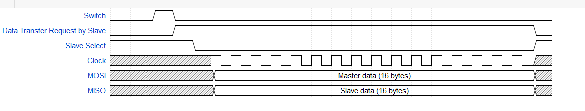
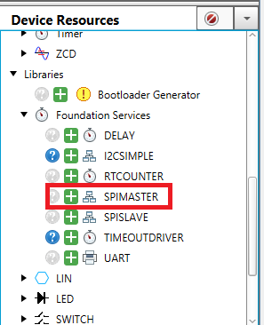

# SPI Slave Initiated transfer Part-1

# Introduction
This demo illustrates the SPI communication between two PIC18F47Q10 MCUs. The Master Synchronous Serial Port (MSSP) module of PIC18F47Q10 can operate as SPI.

One Q10 MCU is configured as an SPI Master and the other as an SPI Slave. The demo uses interrupt-based communication initiation from the slave device. In SPI communication master has control over the clock, thus master initiates the communication by generating the clock.

This example demonstrates, how the slave can request the master to start SPI communication, so the slave can send data to the master.

**This part of the demo illustrates the SPI Master. For slave device example, refer to "[pic18f47q10-spi-slave-initiated-transfer-part2](https://bitbucket.microchip.com/projects/EBE/repos/pic18f47q10-spi-slave-initiated-transfer-part2/browse)".**

# Useful Links
- [PIC18-Q10 Product Family Page](https://www.microchip.com/design-centers/8-bit/pic-mcus/device-selection/pic18f-q10-product-family)
- [PIC18F47Q10 Data Sheet](http://ww1.microchip.com/downloads/en/DeviceDoc/40002043D.pdf)
- [PIC18F47Q10 Code Examples on GitHub](https://github.com/microchip-pic-avr-examples?q=pic18f47q10-cnano)

# Demo Description
 

The demo consists of two **PIC18F47Q10 Curiosity nano** evaluation boards for demonstrating SPI Master and SPI Slave. SPI peripheral's port pins from the master to the slave (SDI, SDO, SCK, and SS) are connected using jumper wires. To enable communication initiation request from the slave, one I/O pin is connected to the master from slave. For initiation of communication, the slave device generates interrupt on GPIO to master device, which notifies the master that the slave has data to send and master can start SPI communication.
In this demo application, switch press event is used as a trigger to exchange data. After pressing the switch on the slave device, it sends an interrupt to the master; then the master selects the slave and, the master and the slave exchanges the data.

This demo also uses UART to send the data serially to the terminal window. Thus, the exchanged data can be observed using a terminal emulator.
Please refer to the timing diagram for details.

## Timing Diagrams

* **Case 1**:  Data transferred from the slave to the master = 16 bytes.

 
**Note**: *This code example transfers 16 bytes of data.*

* **Case 2**: Data transferred from the slave to the master < 16 bytes.  

 
**Note**: *To transfer less than 16 bytes of data, configure the Macro **SPITXBLOCKSIZE** in **main.c** in the slave firmware.*

## Firmware Flowchart

# Hardware Used
* [PIC18F47Q10 Curiosity nano evaluation board](https://www.microchip.com/Developmenttools/ProductDetails/DM182029)

With full program and debug capabilities, the PIC18F47Q10 Curiosity Nano evaluation kit offers complete support for the new design. With the award-winning MPLAB X integrated development platform and MPLAB Code Configurator (MCC), the kit provides access to the Intelligent analog and Core Independent Peripherals on the PIC18F47Q10. Figure 2 shows PIC18F47Q10 Curiosity Nano board.

Figure 1: PIC18F47Q10 Curiosity Nano board
# Software tools
Microchip’s free MPLAB X IDE, compiler and MPLAB Code Configurator (MCC) graphical code generator are used throughout the application firmware development to provide easy and hassle-free user experience. Following are the tool versions used for this demo application:

* [MPLAB® X IDE v5.30](http://www.microchip.com/mplab/mplab-x-ide)
* [XC8 Compiler v2.10](http://www.microchip.com/mplab/compilers)
* [MPLAB® Code Configurator (MCC) v3.85.1](https://www.microchip.com/mplab/mplab-code-configurator)
* [MCC Device Libraries PIC10 / PIC12 / PIC16 / PIC18  MCUs v1.78.0](microchip.com/mplab/mplab-code-configurator)
* [Microchip PIC18F-Q Series Device Support 1.3.89](https://packs.download.microchip.com/)

*Note: For running the demo, the installed tool versions should be same or later. This example is not tested with previous versions.*
# Demo realization
## 1. Creating a new Project
* Open MPLAB X IDE latest version.
* Go to File > New Project (click)
* Select (Categories) Microchip Embedded > (Projects) Standalone Project. (Press Next)
* (Select Device) > Enter Device name (Microcontroller Part Number: in this project enter
  **PIC18F47Q10**) (Press Next)
* Select Tool is optional (Press Next)
* Select Latest XC8 Compiler. (Press Next)
* Enter Project Name and File location. (Press Finish)
* Click on MCC symbol to configure peripherals.

 

## 2. Configure the hardware peripherals
### Configure System Module
1. In Resource Management tab > (Under Project Resources) Select System Module >Select Easy Setup
2. Select Oscillator (**HFINTOSC**)
3. Select HF Internal Clock (**4_MHz**)
4. Select Clock Divider (**1**)
5. Disable Watchdog timer (**WDT Disabled**)
6. Enable Low-voltage Programming

**Note:** *SPI clock frequency depends on this main frequency*

 
### Add SPIMASTER Foundation Services driver and MSSP1 peripheral
1.	Under Device Resources, go to **Libraries** --> **Foundation Services** --> **SPIMASTER** and add **SPIMASTER** by clicking on (+) button.
The SPIMASTER library should show up in **Project** **Resources** under Peripherals.

 

2.	Now in SPIMASTER easy setup tab and add a driver using the "+" sign at the bottom left corner of the window.
3.	This automatically adds **MSSP1** as it supports SPI master communication.
4.	Now go back to SPIMASTER easy setup tab.  Configure parameters of SPI as desired. This example uses default configuration.
5.	Under **Pin Manager: Grid View**, Initially RC4 pin is selected for SDO1 and SDI1, Uncheck RC4 of SDO1 and then Check RC5 for SDO1.

 

### Add and Configure the EUSART Peripheral.
1.	Under **Device Resources**-> **Peripherals** -> **EUSART** -> **EUSART2**.
2.	Click on (+) symbol to add ESURT2.
3.	Select EUSART2 and under Easy Setup, Configure UART.
4.	Disable Receive.
5.	Enable Redirect **STDIO to USART**. (It enables the printf function)
6.	Under **Pin Manager: Grid View**, Uncheck the RB7 Pin (RX2) and RB6 Pin (TX2). And check the RD0 Pin (TX2) to direct ESUART to STDIO.

 

### Configure the pins used on the device (Pin Manager: Grid View)
1.	Open Pin Manager Grid view.
2.	Verify MSSP1 Module Pins:
*    Port C and Pin 3 for SCK1
*    Port C and Pin 4 for SDI1
*    Port C and Pin 5for SDO1
3.	Verify ESUART2 Pins:
*    Port D and Pin 0 for TX
Set the following pins:
*    Port E and Pin 0 as output for LED0
*    Port B and Pin 3 as output for Slave Select
*   Port B and Pin 4 as input for request event from SPI Slave.

 

### Pin Module Configuration
1.	Under Project Resources, click Pin Module.
2.	Change default names under **Custom Name** as shown in figure.
3.	Uncheck the **Analog** checkboxes for all the pins to configure them as digital I/Os.
4.	Check the **Start High** checkbox for pins RB3 and RE0.
5.	Check **WPU** checkbox for pin RB3.
6.	Select **any** in **IOC** setting of RB4.

 

## 3.	Generate the Project files.
Click on save all button and Click the **Generate** button to generate firmware. Verify the Output message.

# Demo Operation
***Refer to "[pic18f47q10-spi-slave-initiated-transfer-part2](https://bitbucket.microchip.com/projects/EBE/repos/pic18f47q10-spi-slave-initiated-transfer-part2/browse)" for Hardware connection and Demo operation.***
